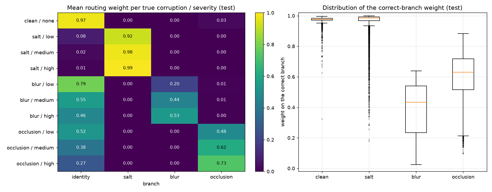
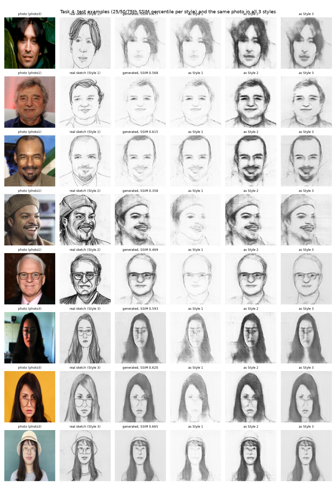
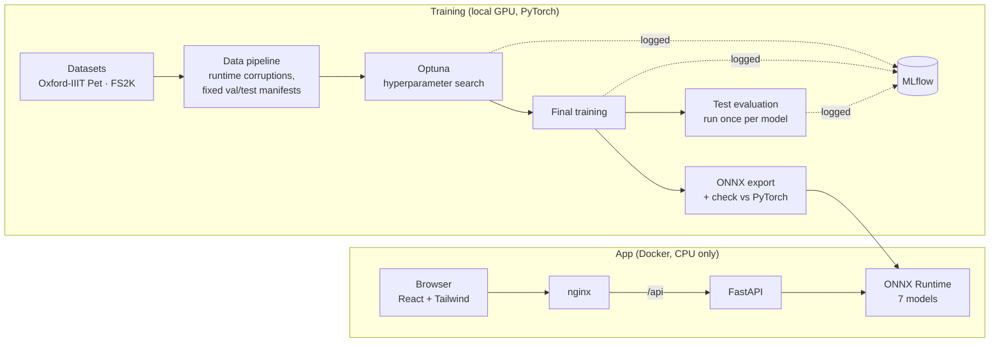
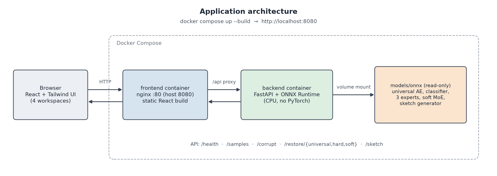
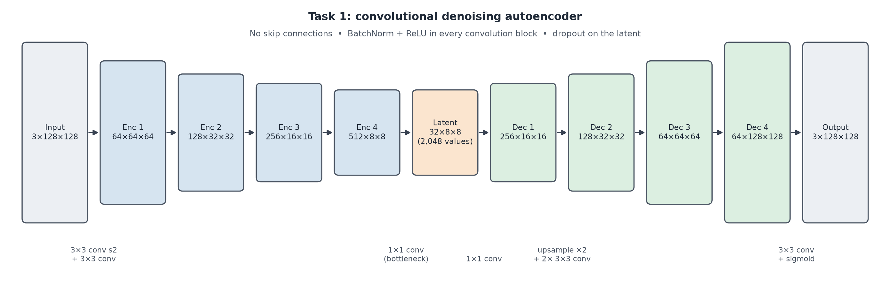
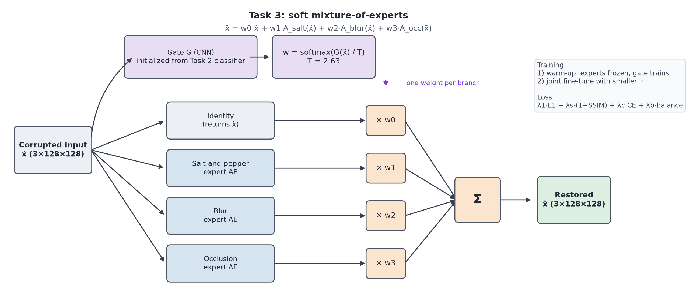
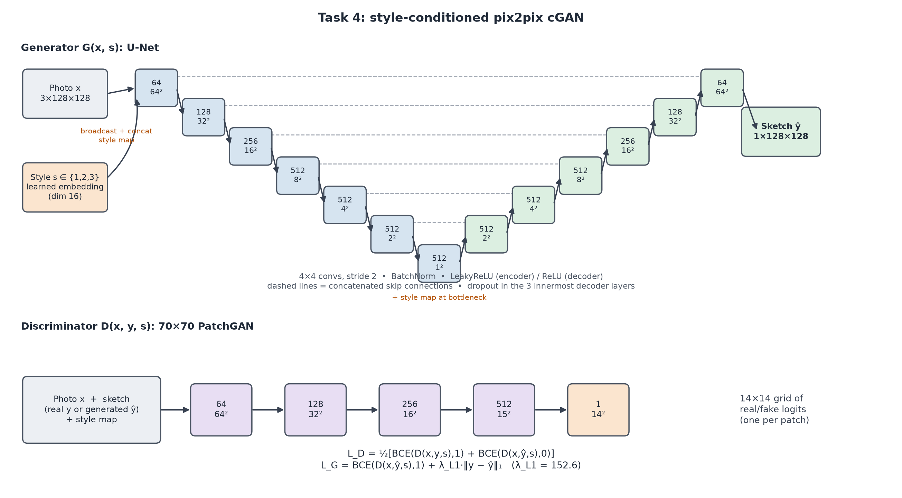
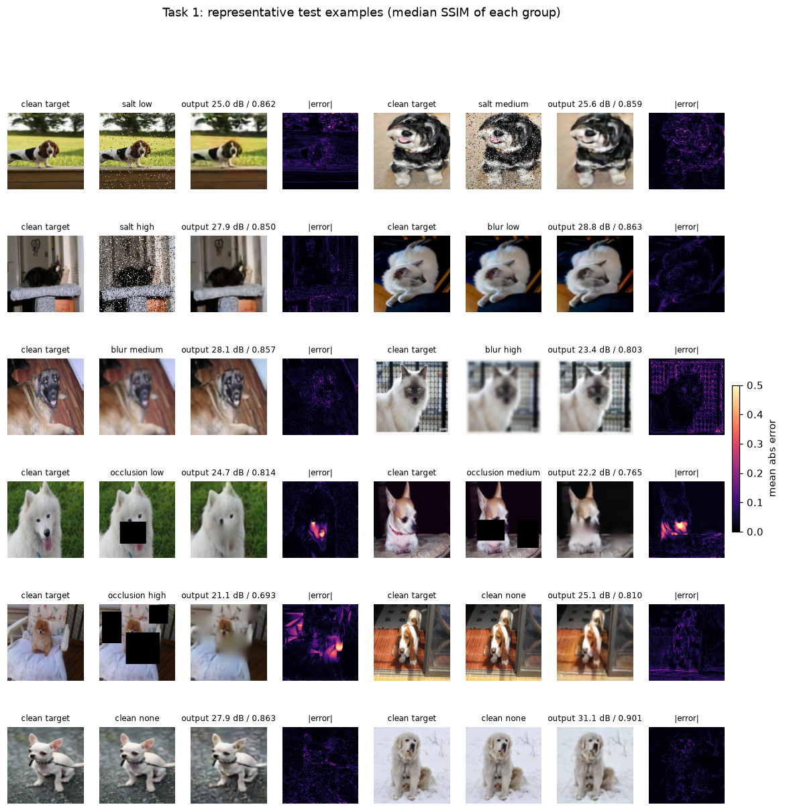

# Image Processing Engine

**Four generative models for repairing damaged photos and drawing faces, in one web app.**

Upload an image (or pick a sample), damage it with noise, blur or missing patches, and watch three different restoration strategies repair it. Or turn a face photo into a pencil sketch in one of three artist styles. Everything runs locally with a single Docker command.

<p align="center">
  
  
</p>

---

## The four models

| | Workspace | What it does | How |
|---|---|---|---|
| 1 | **Universal Restoration** | One model fixes every kind of damage | A convolutional autoencoder squeezes the image through a small 8×8 "bottleneck" and rebuilds it clean |
| 2 | **Hard-Routed Restoration** | Detect the damage first, then call a specialist | A CNN classifier picks *clean / noise / blur / occlusion* and sends the image to exactly one specialist autoencoder (clean images are passed through untouched) |
| 3 | **Soft Mixture-of-Experts** | Blend all specialists instead of picking one | A gate network gives every branch a weight and mixes their outputs; fine-tuned end to end |
| 4 | **Face-to-Sketch Generator** | Photo → sketch in Style 1, 2 or 3 | A style-conditioned pix2pix GAN (U-Net generator + PatchGAN discriminator) |

The three damage types, at three severities each:

| Damage | Low | Medium | High |
|---|---|---|---|
| Salt-and-pepper noise (share of pixels) | 3% | 8% | 15% |
| Gaussian blur (kernel, sigma) | 3, 0.7 | 5, 1.5 | 7, 2.5 |
| Black rectangles (count, area covered) | 1, ~10% | 2, ~20% | 3, ~35% |

---

## How it fits together



**Training side.** Images are damaged on the fly every time they are loaded, so the models never see the same corrupted copy twice. Validation and test damage is fixed in advance (stored "manifests"), so every model is judged on exactly the same 36,690 test inputs. Each model's settings were tuned with Optuna, every run was logged in MLflow, and the test set was used once, at the very end.

**App side.** The trained models are exported to ONNX, a portable format that runs fast on a normal CPU without PyTorch. A FastAPI backend loads them and applies damage with the *same code* used in training; a React frontend shows the results.



---

## Model architectures

**Task 1: universal autoencoder.** The encoder shrinks the image from 128×128 to an 8×8 grid of 2,048 numbers (24× fewer values than the input); the decoder rebuilds it. There are no shortcuts around this bottleneck, so the model has to learn what a clean image looks like.



**Task 2: classifier + specialists.** A small CNN identifies the damage, then one of three autoencoders (each trained only on its own damage type) repairs it. If the image is clean, it is returned unchanged.

**Task 3: soft mixture-of-experts.** The Task 2 classifier becomes a "gate" that weights four branches: the original image, plus the three specialists. The output is their weighted sum, so the model can, for example, keep 80% of a mildly blurred photo and only lightly sharpen it.



**Task 4: face-to-sketch GAN.** A U-Net generator draws the sketch; a PatchGAN discriminator judges small patches as real or fake. The chosen style is a learned embedding fed into *both* networks, so it genuinely changes the drawing.



---

## Results (official test sets)

| Model | Corrupted inputs: SSIM | PSNR | Notes |
|---|---|---|---|
| Damaged input (no repair) | 0.639 | 19.7 dB | baseline |
| 1. Universal autoencoder | 0.806 | 25.5 dB | removes noise well; slightly softens clean images |
| 2. Hard routing | 0.808 | 24.9 dB | classifier 99.8% accurate; clean images kept perfectly |
| 3. Soft mixture-of-experts | **0.845** | **26.2 dB** | best overall; learned to keep more of the original for mild damage |

**Task 4:** test SSIM 0.498. The same face looks clearly different in each style (light lines, heavy shading, soft tones).

All seven ONNX models match their PyTorch originals to within 0.00003 on real images. Full tables, figures and analysis are in [`docs/report_material.md`](docs/report_material.md) and the report.



---

## Run it

You need [Git](https://git-scm.com/) and [Docker Desktop](https://www.docker.com/products/docker-desktop/) (running). No Python or Node required.

**1. Clone the repository**
```bash
git clone https://github.com/FaatehHaneef/Image-Processing-Engine.git
cd Image-Processing-Engine
```

**2. Download the sketch model** (168 MB, too large for GitHub; all other models are already included)
```bash
curl -L -o models/onnx/task4_generator.onnx https://github.com/FaatehHaneef/Image-Processing-Engine/releases/download/models-v1/task4_generator.onnx
```
On Windows PowerShell write `curl.exe` instead of `curl`. Or download it manually from the [release page](https://github.com/FaatehHaneef/Image-Processing-Engine/releases/tag/models-v1) into `models/onnx/`. Without it, the other three workspaces still work.

**3. Start**
```bash
docker compose up --build
```
The first start takes a few minutes. Then open **http://localhost:8080**. The top-right corner shows **Models loaded** when everything is ready. Stop with `Ctrl+C` and `docker compose down`.

### What you can try
- Pick a sample or upload your own JPG/PNG (up to 10 MB); in Face-to-Sketch you can also use your webcam.
- Choose a damage type and severity and click **Apply corruption**, or mark your upload as already damaged.
- Compare outputs, error maps, classifier probabilities (Hard-Routed) and mixture weights with a routing diagram (Soft-MoE).
- Download any result.

---

## Repository layout

```
src/            shared code: data pipeline, corruptions, models, losses, metrics, Optuna/MLflow helpers
scripts/        data preparation, Optuna searches, training, evaluation, ONNX export and verification
configs/        the final settings chosen by Optuna for each model
artifacts/      fixed data splits, test/validation manifests, Optuna studies, result tables
models/onnx/    the exported models used by the app
backend/        FastAPI app, sample images, tests, Dockerfile
frontend/       React + Tailwind app, nginx config, Dockerfile
docs/           design decisions, API contract, dataset notes, figures, AI-use log
tests/          unit tests (pytest)
```

---

## Retraining (optional)

Training needs an NVIDIA GPU (developed on a 4 GB RTX 3050 Ti) and the two datasets, which are not included.

1. Create a Python 3.11 environment and install PyTorch with CUDA, then `pip install -r requirements.txt`.
2. Put the [Oxford-IIIT Pet](https://www.robots.ox.ac.uk/~vgg/data/pets/) dataset in `data/oxford-iiit-pet/` and [FS2K](https://github.com/DengPingFan/FS2K) in `data/fs2k/FS2K/`.
3. Run `python scripts/prepare_data.py` (splits, caches, manifests), then for each task the `optuna_*`, `train_*` and `evaluate_*` scripts in `scripts/`, and finally `export_onnx.py --all` and `verify_onnx.py --all`.

Experiment history: `mlflow ui --backend-store-uri sqlite:///mlruns/mlflow.db`, then open http://127.0.0.1:5000 (choose the "Model training" view).

---

## Credits

- **Oxford-IIIT Pet Dataset**: Parkhi, Vedaldi, Zisserman and Jawahar, "Cats and Dogs", CVPR 2012 (CC BY-SA 4.0). The 16 bundled pet samples are resized test-set images.
- **FS2K**: Fan et al., "Facial-Sketch Synthesis: A New Challenge", Machine Intelligence Research, 2022. The 6 bundled face samples are resized test photos.
- Interface designed in Google Stitch; landing-page illustrations are design artwork, not model outputs.
