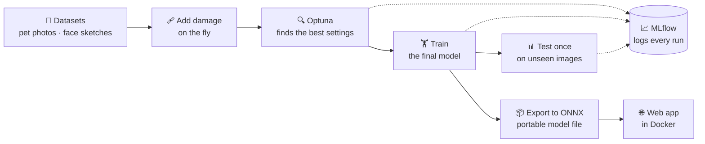
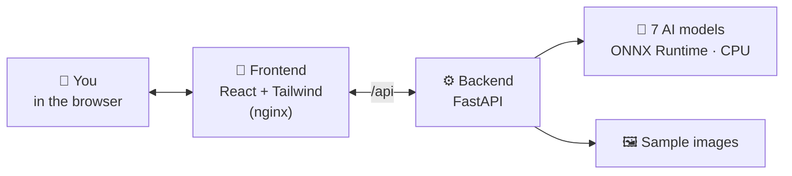
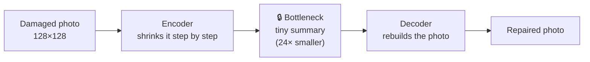
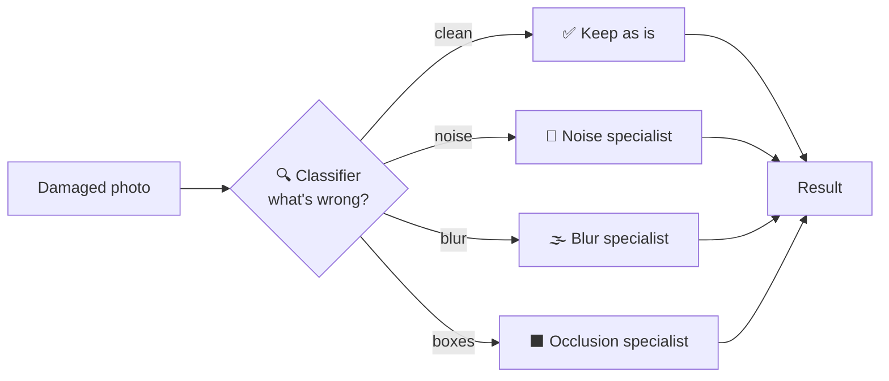
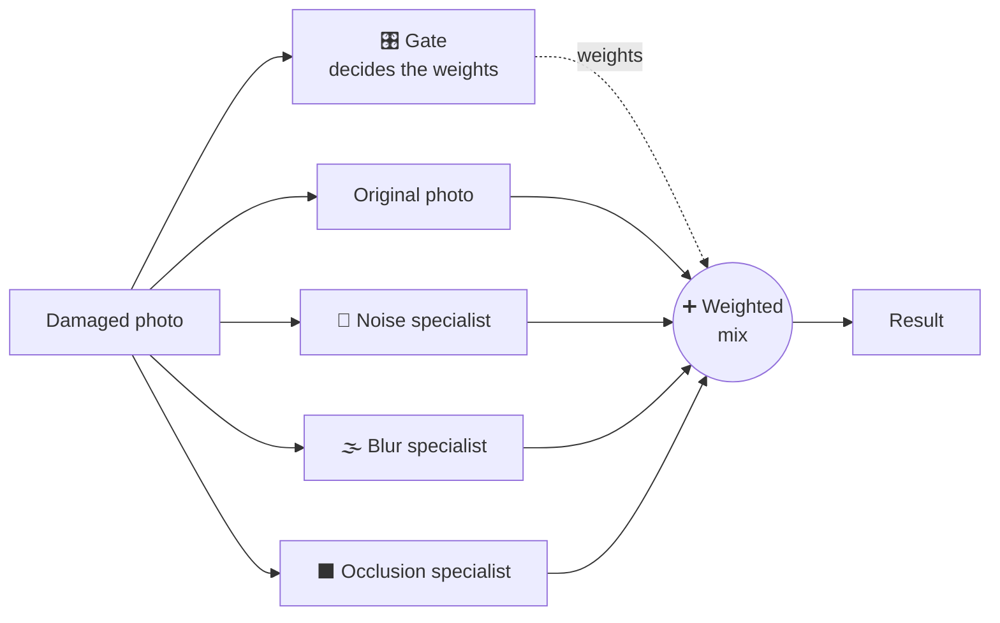
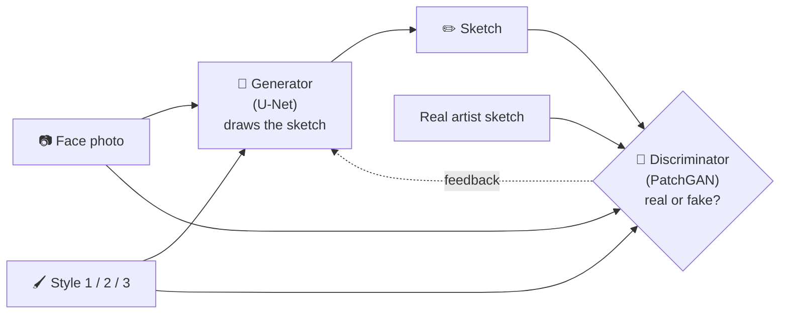

# 🖼️ Image Processing Engine

**Four AI models that repair damaged photos and turn faces into sketches, all in one web app.**

You give it a photo, damage it (noise, blur or black patches), and see how three different AI approaches repair it. Or you give it a face and get a pencil sketch back in one of three artist styles. Everything runs on your own computer with one command.

---

## ✨ What's inside

| | Workspace | In one sentence |
|---|---|---|
| 🧹 | **Universal Restoration** | One model tries to fix *any* kind of damage on its own. |
| 🔀 | **Hard-Routed Restoration** | First figure out *what* is wrong, then send the photo to the one specialist for that problem. |
| 🎛️ | **Soft Mixture-of-Experts** | Ask *all* specialists and blend their answers, trusting some more than others. |
| ✏️ | **Face-to-Sketch Generator** | Turn a face photo into a sketch, in the style you pick. |

### 🩹 The kinds of damage

| | Damage | What it looks like | Low → Medium → High |
|---|---|---|---|
| 🧂 | **Salt-and-pepper noise** | random black and white dots | 3% → 8% → 15% of pixels |
| 🌫️ | **Gaussian blur** | the photo is out of focus | slight → medium → strong |
| ⬛ | **Occlusion** | black boxes hide parts of the photo | 1 box (~10%) → 2 (~20%) → 3 (~35%) |

---

## 🔄 The pipeline: from data to app



**In plain words:**

1. 📂 **Data:** pet photos (Oxford-IIIT Pet) for the repair tasks, and face photos with artist sketches (FS2K) for the sketch task.
2. 🩹 **Damage on the fly:** every time a photo is loaded during training, it gets a fresh random damage, so the models never memorise one fixed version. The test photos get *fixed* damage, so all models are compared on exactly the same 36,690 images.
3. 🔍 **Optuna** tries many combinations of settings (learning rate, model size, …) and keeps the best one.
4. 🏋️ **Training** builds the final model with those settings.
5. 📊 **Testing** happens once, at the very end, on images the model has never seen.
6. 📦 **ONNX export** saves each model in a portable format that runs fast on a normal CPU, no GPU needed.
7. 📈 **MLflow** keeps a record of every experiment along the way.

---

## 🏗️ How the app is built



- 🎨 The **frontend** is the website you click around in.
- ⚙️ The **backend** receives your photo, checks it, applies damage using the *same code* as training, and runs the models.
- 🧠 The **models** are the 7 exported files: 1 universal repairer, 1 damage classifier, 3 specialists, 1 mixture model and 1 sketch generator.
- 🐳 **Docker** packs both parts into containers, so the whole thing starts with one command on any computer.

---

## 🧠 How each model works

### 🧹 1. Universal Restoration: one model for everything



The model has to squeeze the whole photo into a tiny summary and rebuild it from there. Noise and damage don't fit through that squeeze, so they get removed. The catch: fine details don't fit either, so results look a little soft.

### 🔀 2. Hard-Routed Restoration: diagnose, then treat



A classifier (99.8% accurate) decides what kind of damage the photo has and sends it to the one specialist trained for exactly that. Clean photos skip the repair step completely, so they come out perfect.

### 🎛️ 3. Soft Mixture-of-Experts: blend everyone's answer



Instead of picking one specialist, a "gate" gives each option a weight (e.g. 80% original photo + 20% blur specialist) and mixes them. It learned on its own to keep more of the original when the damage is mild, which made it the **best** of the three repair models.

### ✏️ 4. Face-to-Sketch Generator: an artist and a critic



Two networks train against each other: the **generator** draws sketches, and the **discriminator** tries to tell its sketches apart from real artist drawings. Over time the generator gets better at fooling it. The chosen style goes into both networks, so the same face really comes out differently in each style.

---

## 📊 Results

How well each repair model does on the test photos (higher is better):

| | Model | Similarity to original (SSIM) | Image quality (PSNR) |
|---|---|---|---|
| 🩹 | Damaged photo, no repair | 0.639 | 19.7 dB |
| 🧹 | Universal Restoration | 0.806 | 25.5 dB |
| 🔀 | Hard-Routed Restoration | 0.808 | 24.9 dB |
| 🎛️ | **Soft Mixture-of-Experts** | **0.845** 🏆 | **26.2 dB** 🏆 |

- 🔍 The damage classifier picks the right specialist **99.8%** of the time.
- ✏️ The sketch generator produces clearly different drawings for the three styles: light lines, heavy shading, soft grey tones.
- ✅ Every exported model gives the same answers as the original training code (difference below 0.00003).

---

## 🚀 Run it yourself

**You need:** 🔧 [Git](https://git-scm.com/) and 🐳 [Docker Desktop](https://www.docker.com/products/docker-desktop/) (open and running). No Python or programming setup needed.

**1️⃣ Get the code**
```bash
git clone https://github.com/FaatehHaneef/Image-Processing-Engine.git
cd Image-Processing-Engine
```

**2️⃣ Download the sketch model** (168 MB, too big to store on GitHub directly)
```bash
curl -L -o models/onnx/task4_generator.onnx https://github.com/FaatehHaneef/Image-Processing-Engine/releases/download/models-v1/task4_generator.onnx
```
On Windows PowerShell, type `curl.exe` instead of `curl`. You can also download it from the [release page](https://github.com/FaatehHaneef/Image-Processing-Engine/releases/tag/models-v1) and put it in `models/onnx/`.

**3️⃣ Start the app**
```bash
docker compose up --build
```
⏳ The first start takes a few minutes. Then open 👉 **http://localhost:8080**

When the top-right corner shows 🟢 **Models loaded**, you're ready. To stop: press `Ctrl+C`, then run `docker compose down`.

### 🎮 Things to try
- 📤 Upload your own photo (JPG/PNG, up to 10 MB) or pick one of the samples.
- 🩹 Choose a damage type and strength, click **Apply corruption**, then **Restore**.
- 👀 Compare the result, the error map, the classifier's guesses and the mixture weights.
- 📷 In Face-to-Sketch, try your webcam and switch between the three styles.
- 💾 Download any result.

---

## 📁 What's in the repository

| Folder | Contents |
|---|---|
| 📦 `src/` | shared code: data loading, damage functions, models, training helpers |
| 🛠️ `scripts/` | data preparation, Optuna searches, training, testing, ONNX export |
| ⚙️ `configs/` | the best settings Optuna found for each model |
| 📊 `artifacts/` | data splits, fixed test damage, Optuna studies, result tables |
| 🧠 `models/onnx/` | the exported models the app uses |
| ⚙️ `backend/` | the FastAPI server, sample images, tests |
| 🎨 `frontend/` | the React website |
| 📝 `docs/` | design decisions, figures and notes |
| ✅ `tests/` | automated tests |

---

## 🔁 Retraining (optional)

Only needed if you want to train the models again yourself. It requires an NVIDIA GPU (built on a 4 GB RTX 3050 Ti) and the two datasets, which aren't included.

1. Create a Python 3.11 environment, install PyTorch with CUDA, then `pip install -r requirements.txt`.
2. Put [Oxford-IIIT Pet](https://www.robots.ox.ac.uk/~vgg/data/pets/) in `data/oxford-iiit-pet/` and [FS2K](https://github.com/DengPingFan/FS2K) in `data/fs2k/FS2K/`.
3. Run `python scripts/prepare_data.py`, then the `optuna_*`, `train_*` and `evaluate_*` scripts for each task, and finally `export_onnx.py --all`.

📈 To browse the experiment history: `mlflow ui --backend-store-uri sqlite:///mlruns/mlflow.db`, then open http://127.0.0.1:5000 and choose **Model training**.

---

## 🙏 Credits

- **Oxford-IIIT Pet Dataset**: Parkhi et al., "Cats and Dogs", CVPR 2012 (CC BY-SA 4.0). The 16 sample pet photos come from its test set.
- **FS2K**: Fan et al., "Facial-Sketch Synthesis: A New Challenge", 2022. The 6 sample faces come from its test set.
- Interface designed with Google Stitch.
